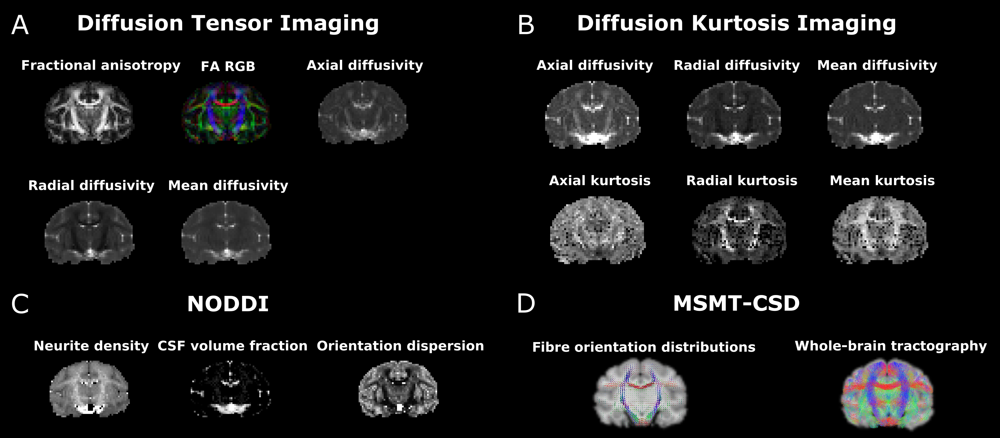

# Diffusion-MRI (dMRI)
These Jupyter notebooks include diffusion MRI data analysis to calculate __Diffusion Tensor Imaging (DTI)__, __Diffusion Kurtosis Imaging (DKI)__, __Neurite Orientation Dispersion and Density Imaging (NODDI)__, __Single-Shell 3-tissue Constrained Spherical Deconvolution (SS3T-CSD)__, and __Multi-Shell Multi-Tissue Constrained Spherical Deconvolution (MSMT-CSD)__ modeled parametric maps.

__Pre-processing__ Jupyter notebook includes data __denoising__ using DIPY, susceptibility-induced distortion correction using FSL __TOPUP__ and eddy current-induced distortion and motion correction using FSL __EDDY__.

Note: estimation of DKI, NODDI, and MSMT-CSD modeled parametric maps require diffusion-weighted MRI data acquired for at least two b-values (e.g. 1000, 2000).

### Dependencies
Dependencies to use these Jupyter notebooks are:
* DIPY (https://dipy.org/)
* Nipype (https://nipype.readthedocs.io/en/latest/)
* FSL (https://fsl.fmrib.ox.ac.uk/fsl/fslwiki/FSL)
* AMICO (https://github.com/daducci/AMICO)
* MRtrix3 (https://www.mrtrix.org/)

### Citation
#### A collaborative resource platform for non-human primate neuroimaging
Adam Messinger, Nikoloz Sirmpilatze, Katja Heuer, Kep Kee Loh, Rogier B. Mars, Julien Sein, Ting Xu, Daniel Glen, Benjamin Jung, Jakob Seidlitz, Paul Taylor, Roberto Toro, Eduardo A. Garza-Villarreal, Caleb Sponheim, Xindi Wang, R. Austin Benn, Bastien Cagna, Rakshit Dadarwal, Henry C. Evrard, Pamela Garcia-Saldivar, Steven Giavasis, Renée Hartig, Claude Lepage, Cirong Liu, Piotr Majka, Hugo Merchant, Michael P. Milham, Marcello G.P. Rosa, Jordy Tasserie, Lynn Uhrig, Daniel S. Margulies, P. Christiaan Klink \
bioRxiv 2020.07.31.230185; doi: https://doi.org/10.1101/2020.07.31.230185

### Example dataset: 
In vivo diffusion MRI data (__Macaca mulatta brain__ scanned at Siemens 3T) provided by the Aix-Marseille Université at the __PRIMatE Data Exchange__ (http://fcon_1000.projects.nitrc.org/indi/indiPRIME.html).

